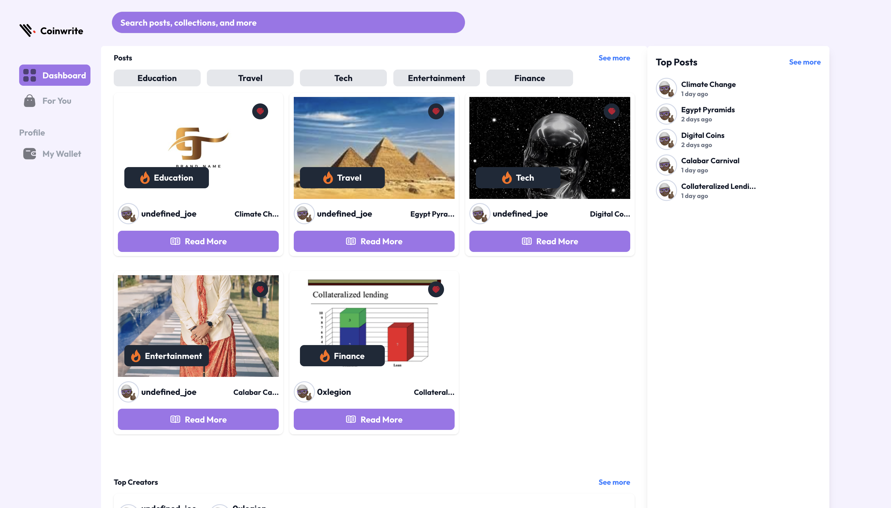
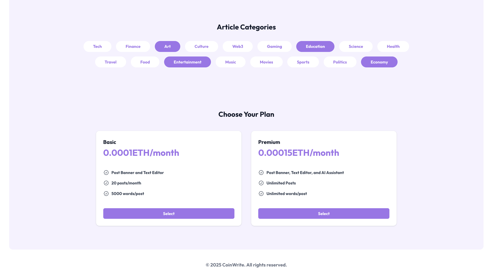
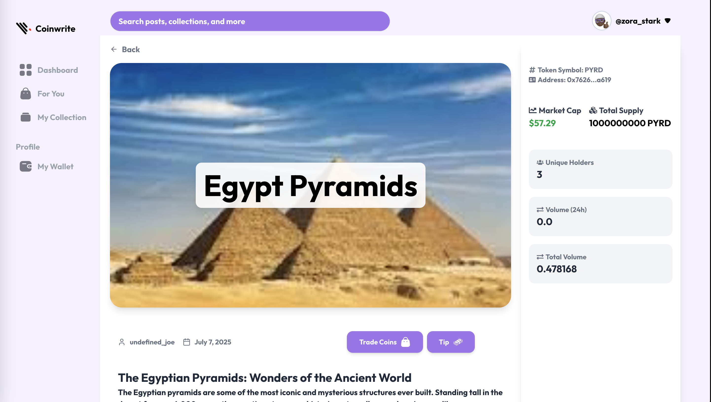
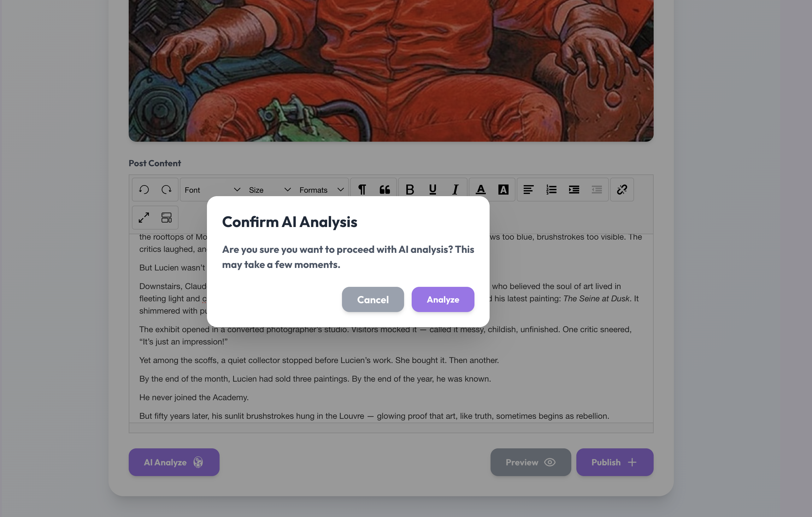
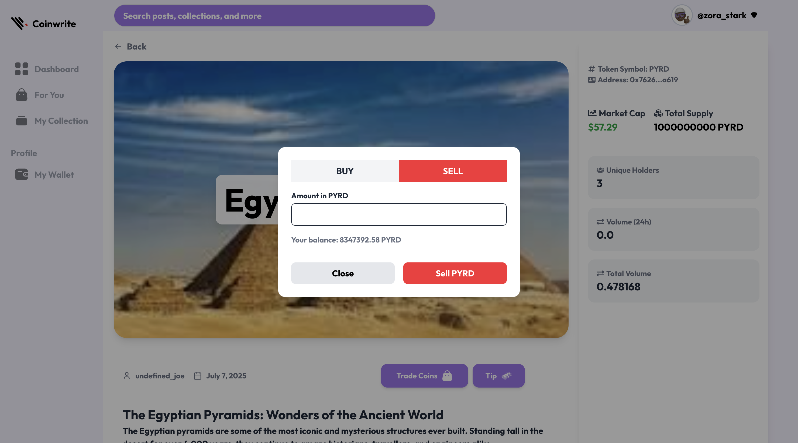
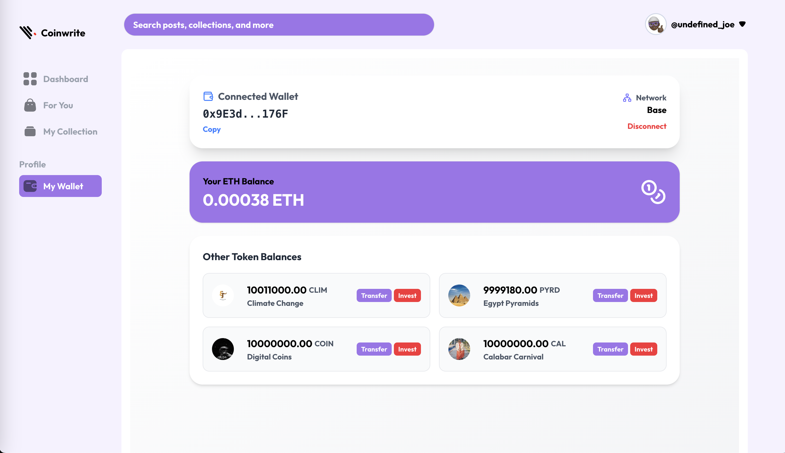
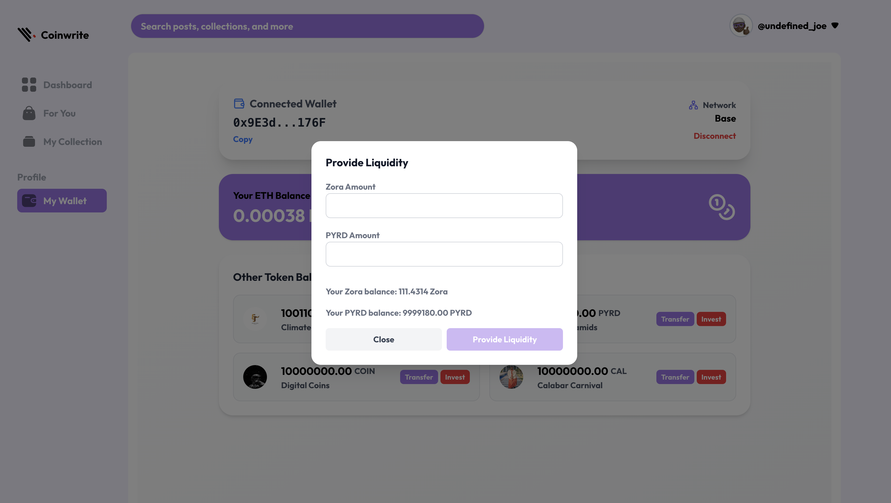

# CoinWrite - Decentralized Content Platform

CoinWrite is a decentralized content platform that allows users to create, trade, and monetize their posts as tradable tokens. Built on the Base blockchain and leveraging the Zora SDK, CoinWrite integrates advanced features like AI-powered content refinement, IPFS for decentralized storage, and a seamless wallet experience. This README provides a comprehensive overview of the project, its features, and how it works.

---



## Features

### 1. **Posting Posts as Tradable Tokens**
   - **Zora SDK Integration**: Posts are minted as tradable tokens using the Zora SDK, enabling users to tokenize their content and trade it on the platform.
   - **Tokenization**: Each post is represented as an ERC20 token, allowing users to buy, sell, and hold posts as assets.
   - **Decentralized Storage**: Post content and banner images are uploaded to IPFS using Pinata, ensuring decentralization and immutability.

### 2. **AI-Powered Content Refinement**
   - **LLM Integration**: A server-side AI model corrects grammatical errors and refines post content, ensuring high-quality posts.
   - **Content Enhancement**: The AI suggests improvements to make posts more engaging and professional.

### 3. **Buying and Selling Post Tokens**
   - **Marketplace**: Users can buy and sell post tokens on the platform, creating a marketplace for content.
   - **Liquidity Provision**: Liquidity is provided for trading post tokens, allowing users to invest in content as an asset class.

### 4. **Tipping Post Creators**
   - **ERC20 Tipping**: Users can tip post creators using ERC20 tokens, rewarding them for their content.
   - **Seamless Transactions**: Tipping is integrated into the platform, making it easy for users to support creators.

### 5. **Wallet Feature**
   - **Coin Tracking**: Users can track the coins they own in their wallet, including post tokens and tips received.
   - **Coin Transfers**: Users can transfer their coins to other wallets, enabling peer-to-peer transactions.

### 6. **Registration with Subscription Plans**
   - **Subscription Tiers**: Users can register with different subscription plans (Basic or Premium), which determine their posting fees and benefits.
   - **Personalized FYP**: During registration, users select their interests, which are used to build a personalized "For You Page" (FYP).

### 7. **IPFS Integration**
   - **Decentralized Storage**: Post content and banner images are uploaded to IPFS using Pinata, ensuring decentralization and immutability.
   - **Content Accessibility**: IPFS ensures that content is accessible even if the platform goes offline.

### 8. **Liquidity Provision for Trading**
   - **Investment Opportunity**: Users can provide liquidity for trading post tokens, earning rewards for facilitating trades.
   - **Market Stability**: Liquidity ensures that post tokens can be traded without significant price fluctuations.

---

## Technical Details

### 1. **Zora SDK and Contracts**
   - **Zora SDK**: The platform uses the Zora SDK to mint and manage post tokens, enabling seamless integration with the Base blockchain.
   - **CoinWrite Contract**: The `CoinWrite.sol` smart contract handles user registration, subscription plans, and post token management. It is deployed on the Base mainnet.

### 2. **Base Blockchain**
   - **Deployment**: The platform is deployed on the Base blockchain, ensuring low transaction fees and high scalability.
   - **Interoperability**: Base's compatibility with Ethereum allows for easy integration with existing Ethereum tools and services.

### 3. **AI Server**
   - **LLM Model**: A local server-side AI model processes post content, correcting grammatical errors and refining the text.
   - **API Integration**: The AI server is integrated into the platform via an API, ensuring real-time content refinement.


### 4. **IPFS and Pinata**
   - **Decentralized Storage**: Post content and banner images are uploaded to IPFS using Pinata, ensuring decentralization and immutability.
   - **Content Accessibility**: IPFS ensures that content is accessible even if the platform goes offline.

### 5. **Wallet Integration**
   - **Wagmi and Web3Modal**: The platform uses Wagmi and Web3Modal for wallet integration, enabling users to connect their wallets and manage their assets.
   - **ERC20 Support**: The wallet supports ERC20 tokens, including post tokens and tips.

---

## User Interface

### 1. **Beautiful and Intuitive Design**
   - **Tailwind CSS**: The platform uses Tailwind CSS for a modern and responsive design.

   - **User-Friendly**: The interface is designed to be easy to use, even for non-technical users.


### 2. **Personalized Experience**
   - **For You Page (FYP)**: The FYP is personalized based on the user's interests, ensuring they see relevant content.
   - **Dashboard**: The dashboard provides an overview of the user's posts, coins, and wallet balance.


### 3. **Seamless Navigation**
   - **Sidebar and Top Header**: The sidebar and top header provide easy navigation between different sections of the platform.
   - **Responsive Design**: The platform is fully responsive, ensuring a seamless experience on both desktop and mobile devices.

---


## How It Works

### 1. **User Registration**
   - Users register with a username, subscription tier, and interests.
   - The subscription tier determines the posting fee and benefits.

   

### 2. **Post Creation**
   - Users create posts, which are tokenized using the Zora SDK.
   - Post content and banner images are uploaded to IPFS using Pinata.

   

### 3. **Content Refinement**
   - The AI server processes the post content, correcting grammatical errors and refining the text.

   

### 4. **Trading and Tipping**
   - Users can buy, sell, and trade post tokens on the platform.
   - Users can tip post creators using ERC20 tokens.

   

### 5. **Wallet Management**
   - Users can track their coins and transfer them to other wallets.

   

### 6. **Liquidity Provision**
   - Users can provide liquidity for trading post tokens, earning rewards for facilitating trades.

   

---

## Conclusion

CoinWrite is a revolutionary platform that combines blockchain technology, AI, and decentralized storage to create a new way for users to create, trade, and monetize content. With its beautiful UI, easy-to-use features, and robust technical foundation, CoinWrite is poised to become the go-to platform for decentralized content creation and trading.

---

## Getting Started

### Prerequisites
- Node.js
- MetaMask or any Ethereum-compatible wallet
- Base-compatible RPC URL

### Installation
1. Clone the repository:
   ```bash
   git clone https://github.com/your-repo/coinwrite.git
   ```
2. Install dependencies:
   ```bash
   npm install
   ```
3. Start the development server:
   ```bash
   npm run dev
   ```

### Deployment
1. Deploy the `CoinWrite.sol` contract to the Base mainnet.
2. Update the contract address in the `App.jsx` file.
3. Deploy the platform to your preferred hosting service.

---

## Contributing
Contributions are welcome! Please open an issue or submit a pull request.

---

## License
This project is licensed under the MIT License. See the [LICENSE](LICENSE) file for details.

---

Thank you for using CoinWrite! We hope you enjoy the platform and find it useful for your content creation, investment and trading needs.
